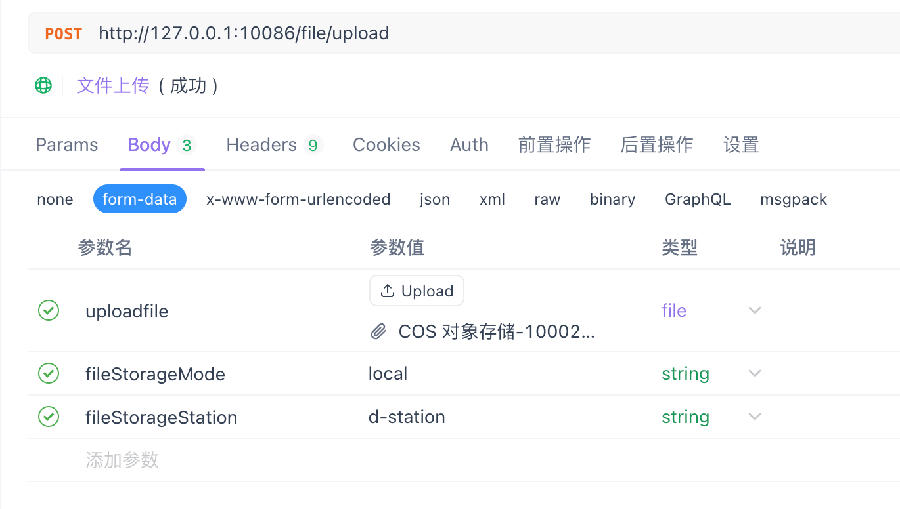
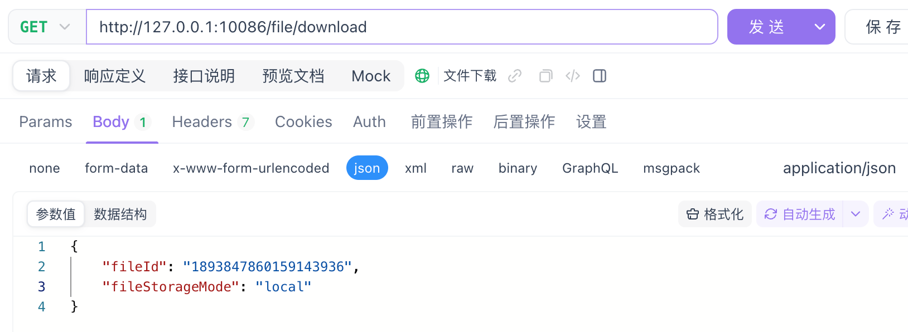
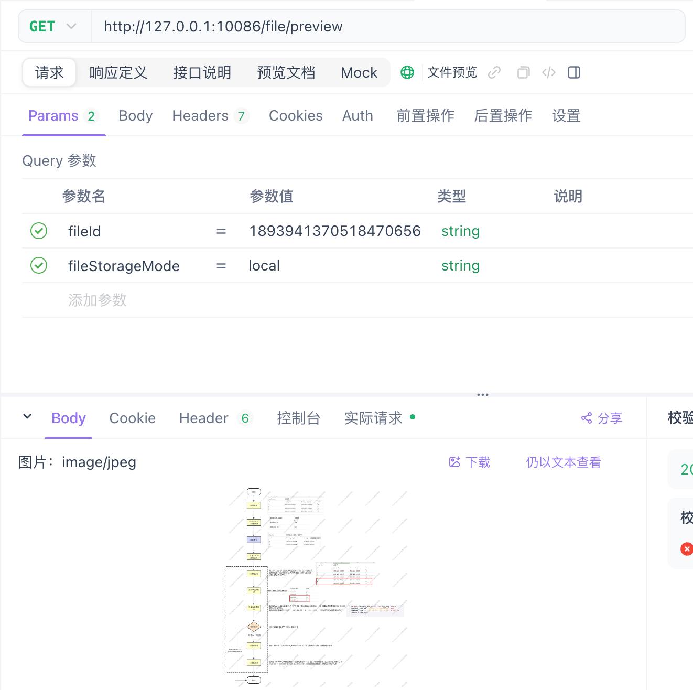
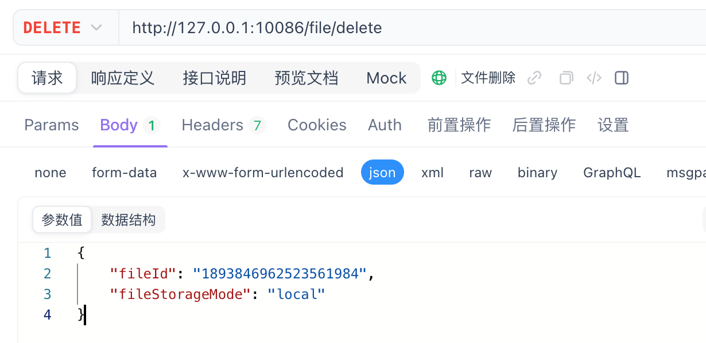

# qof-spring-boot-starter （快联文件桥）

## 一、使用说明

### 1. 添加项目的依赖

如果 **只需要使用文件操作 SDK（不暴露HTTP接口）**，则引入核心模块：

```xml
<dependency>
    <groupId>io.github.codeyunze</groupId>
    <artifactId>qof-core</artifactId>
    <version>0.0.X</version>
</dependency>
```

如果 **需要直接使用文件操作HTTP API接口**，则额外引入 Web 模块（原 `qof-core`，现已更名为 `qof-web`）：

```xml
<dependency>
    <groupId>io.github.codeyunze</groupId>
    <artifactId>qof-web</artifactId>
    <version>0.0.7</version>
</dependency>
```

如果希望参考完整示例工程（含启动类与示例配置），可以引入示例模块：

```xml
<dependency>
    <groupId>io.github.codeyunze</groupId>
    <artifactId>qof-starter</artifactId>
    <version>0.0.X</version>
</dependency>
```


### 2. 选择对应的文件存储模式

   | 存储模式 | 说明                                                         | 是否支持 |
   | -------- | ------------------------------------------------------------ | -------- |
   | local    | 本地存储，将文件存储在服务器本地。                           | 支持     |
   | cos      | 腾讯云的COS对象存储，将文件上传至腾讯云的COS对象存储服务里。 | 支持     |
   | oss      | 阿里云的OSS对象存储，将文件上传至阿里云的OSS对象存储服务里。 | 待开发   |

### 3. 添加对应存储模式的配置信息

   local模式配置信息：

   ```yaml
   qof:
     persistent-enable: true
     local:
       enable: true
       filepath: /c/files
   ```

   local模式多个存储站配置信息：

   ```yaml
   qof:
     persistent-enable: true
     local:
       enable: true
       filepath: /files
       default-storage-station: c-station
       multiple:
         c-station:
           filepath: /c/files
         d-station:
           filepath: /d/files
   ```

   cos模式配置信息：

   ```yaml
   qof:
     persistent-enable: true
     cos:
       enable: true
       default-storage-station: gz-station
       multiple:
         gz-station:
           secret-id: 腾讯云账号秘钥id
           secret-key: 腾讯云账号秘钥Key
           bucket-name: gz-1306261191
           region: ap-guangzhou
           filepath: /guangzhou
         bj-station:
           secret-id: 腾讯云账号秘钥id
           secret-key: 腾讯云账号秘钥Key
           bucket-name: bj-1396261205
           region: ap-beijing
           filepath: /beijing
   
   ```

   > 对象存储分为如下两个维度
   >
   > 1. 第一级为存储模式( `mode` )，如 `local` （本地存储）、 `cos` （腾讯云对象存储）、 `oss` （阿里云对象存储）等
   >
   > 2. 第二级为存储站( `station` )，存储站的定义为一个存储模式下可以有多个存储站点；
   >
   >    **local模式** 案例:
   >
   >    ​	同一个模式local下，一部分文件要存C盘，一部分文件要存D盘。
   >
   >    ​	这时候就可以使用存储站，第一个存储站station-c，存储路径指向C盘，第二个存储站station-d，存储路径指向D盘。
   >
   >    **cos模式** 案例:
   >
   >    ​	同一个模式cos下，一部分文件要存放在ap-guangzhou（广州地区）的存储桶bucket-gz，另一部分文件要存放在ap-beijing（北京地区）的存储桶bucket-bj。
   >
   >    ​	这时候就可以使用存储站，第一个存储站gz-station，存储路径指向存储桶bucket-gz，第二个存储站bj-station指向bucket-bj。

### 4. 使用方法1-调用文件操作SDK

   ​**第一步：** 注入 `QofClientFactory` 客户端创建工厂。

```java
    @Autowired
    private QofClientFactory qofClientFactory;
```
   ​**第二步：** 根据需要创建所需存储模式的操作客户端。

   ```java
   QofClient client = qofClientFactory.buildClient("存储模式");
   ```

   > 存储模式可传入local或cos。
   >
   > 传入local，则会创建本地文件操作客户端；传入cos，则会创建腾讯云COS对象存储操作客户端；

   ​**第三步：** 根据需求调用操作SDK

 QofClient接口信息如下：

#### 文件上传接口

   ```java
   		/**
        * 上传文件信息
        *
        * @param fis  上传文件的输入流
        * @param info 上传文件的基础信息
        * @return 文件唯一id
        */
       Long upload(InputStream fis, QofFileInfoDto info);
   ```

调用方式：

```java
client.upload(fis, info);
```

#### 文件下载接口

   ```java
   		/**
        * 下载文件
        *
        * @param fileId 文件唯一id
        * @return 文件流数据
        */
       QofFileDownloadBo download(Long fileId);
   ```

调用方式：

```java
client.download(1893847860159143936);
```

#### 文件预览接口

   ```java
   		/**
        * 预览文件
        *
        * @param fileId 文件唯一id
        * @return 文件流数据
        */
       QofFileDownloadBo preview(Long fileId);
   ```

调用方式：

```java
client.preview(1893847860159143936);
```

#### 文件删除接口

   ```java
   		/**
        * 删除文件
        *
        * @param fileId 删除文件的唯一id
        * @return true: 删除成功；  false: 删除失败；
        */
       boolean delete(Long fileId);
   ```

调用方式：

```java
client.delete(1893847860159143936);
```

### 5. 使用方法2-调用文件操作API

#### 文件上传接口

接口地址：http://127.0.0.1:10086/file/upload

请求类型：POST

ContentType：multipart/form-data

Body参数：

| 参数               | 类型                  | 说明                                  |
| ------------------ | --------------------- | ------------------------------------- |
| uploadfile         | file（MultipartFile） | （必传）需要上传的文件                |
| fileStorageMode    | String                | （必传）文件存储模式(local、cos、oss) |
| fileStorageStation | String                | （可选）文件存储站                    |



响应信息：

| 参数 | 类型   | 说明                                                        |
| ---- | ------ | ----------------------------------------------------------- |
| code | int    | 返回状态编码（200: 正常；1: 参数校验不通过；2: 数据不存在） |
| msg  | String | 提示信息                                                    |
| data | Long   | 文件唯一Id                                                  |

#### 文件下载接口

接口地址：http://127.0.0.1:10086/file/download

请求类型：GET

ContentType：application/json

Body参数：

| 参数            | 类型   | 说明                                  |
| --------------- | ------ | ------------------------------------- |
| fileId          | Long   | （必传）文件唯一标识                  |
| fileStorageMode | String | （必传）文件存储模式(local、cos、oss) |



响应信息：

文件流数据

#### 文件预览接口

接口地址：http://127.0.0.1:10086/file/preview?fileId=1893941370518470656&fileStorageMode=local

请求类型：GET

Body参数：

| 参数            | 类型   | 说明                                  |
| --------------- | ------ | ------------------------------------- |
| fileId          | Long   | （必传）文件唯一标识                  |
| fileStorageMode | String | （必传）文件存储模式(local、cos、oss) |



#### 文件删除接口

接口地址：http://127.0.0.1:10086/file/delete

请求类型：DELETE

ContentType：application/json

Body参数：

| 参数            | 类型   | 说明                                  |
| --------------- | ------ | ------------------------------------- |
| fileId          | Long   | （必传）文件唯一标识                  |
| fileStorageMode | String | （必传）文件存储模式(local、cos、oss) |



## 二、扩展说明

QOF 提供了文件相关操作之前和之后的扩展接口

### 可扩展接口

```java
		/**
     * 文件上传之前
     *
     * @param fileDto 新增文件基础数据
     * @return 主键Id, 如果上传失败则返回null
     */
    Long beforeUpload(QofFileInfoDto fileDto);

    /**
     * 文件上传之后
     *
     * @param fileDto 文件基础数据
     * @return 主键Id, 如果上传失败则返回null
     */
    QofFileInfoBo afterUpload(QofFileInfoDto fileDto);

    /**
     * 下载前执行操作
     *
     * @param fileId 文件Id
     */
    void beforeDownload(Long fileId);

    /**
     * 下载后执行操作
     *
     * @param fileId 文件Id
     */
    void afterDownload(Long fileId);

    /**
     * 文件删除前执行操作
     *
     * @param fileId 删除文件Id
     * @return true: 文件删除前执行操作成功；   false: 文件删除前执行操作失败；
     */
    boolean beforeDelete(Long fileId);

    /**
     * 文件删除后执行操作
     *
     * @param fileBo  删除文件信息
     * @param deleted 删除结果 true: 文件删除成功 false: 文件删除失败
     * @return true: 文件删除后执行操作成功；   false: 文件删除后执行操作失败；
     */
    boolean afterDelete(QofFileInfoBo<?> fileBo, boolean deleted);
```


### 扩展方式

继承 `io.github.codeyunze.service.impl.AbstractQofServiceImpl` ，添加 `@Primary` 和 `@Service` 注解，重写需要的接口。

> 注意：方法被重写之后，默认的实现方法不会再执行。

案例如下：

```java
package io.github.codeyunze.service.impl;

import io.github.codeyunze.dto.QofFileInfoDto;
import io.github.codeyunze.service.SysFilesService;
import org.slf4j.Logger;
import org.slf4j.LoggerFactory;
import org.springframework.context.annotation.Primary;
import org.springframework.stereotype.Service;

/**
 * QOF文件信息操作扩展接口自定义实现
 *
 * @author 高晗
 * @since 2025/2/18 07:49
 */
@Primary
@Service
public class CustomQofServiceImpl extends AbstractQofServiceImpl {
    private static final Logger log = LoggerFactory.getLogger(CustomQofServiceImpl.class);
    public CustomQofServiceImpl(SysFilesService filesService) {
        super(filesService);
    }

    @Override
    public Long beforeUpload(QofFileInfoDto<?> fileDto) {
        log.info("自定义-文件上传前执行");
        return super.beforeUpload(fileDto);
    }

    @Override
    public boolean afterDelete(QofFileInfoBo<?> fileBo, boolean deleted) {
        log.info("自定义-文件删除后执行");
        return true;
    }
}
```


## 三、建表语句

```sql
create table sys_files
(
    id                   bigint                                not null comment '主键标识'
        primary key,
    create_time          datetime    default CURRENT_TIMESTAMP not null comment '创建时间',
    update_time          datetime    default CURRENT_TIMESTAMP null comment '更新时间',
    invalid              bigint      default 0                 not null comment '数据是否有效：0数据有效',
    file_name            varchar(100)                          not null comment '文件名称',
    file_path            varchar(255)                          not null comment '文件路径',
    file_type            varchar(100)                          not null comment '文件类型(image/png、image/jpeg)',
    file_label           varchar(36)                           null comment '文件标签',
    file_size            bigint      default 0                 not null comment '文件大小(单位byte字节)',
    file_storage_mode    varchar(10) default 'local'           not null comment '文件存储模式(local、cos、oss)',
    file_storage_station varchar(36)                           null comment '文件存储站'
) comment '系统-文件表';
```

