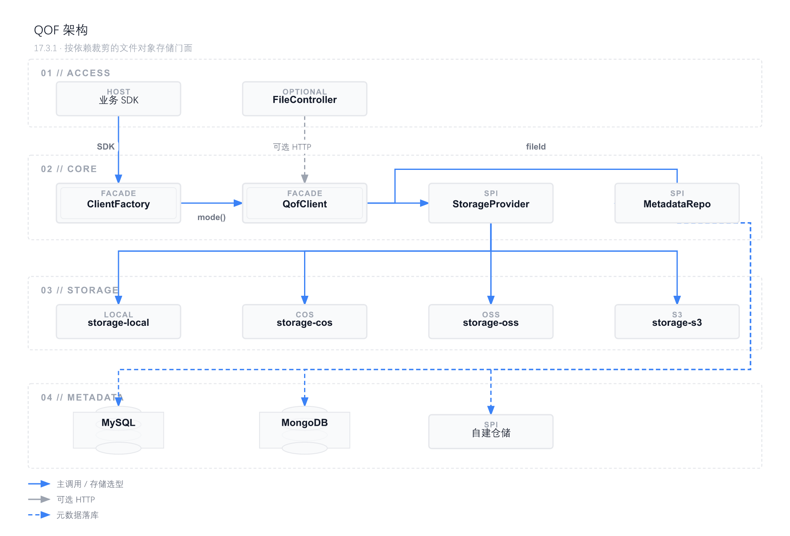
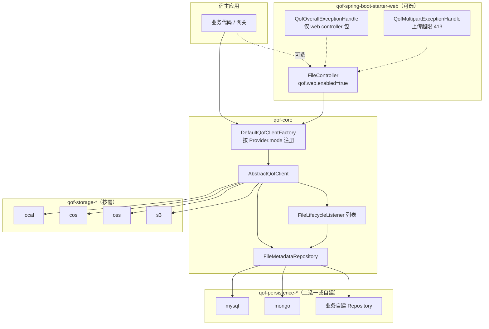

# QOF（快联文件桥）架构说明

| 项 | 内容 |
|---|---|
| 文档版本 | 2.0 |
| 适用代码版本 | **17.3.1**（JDK 17 / Spring Boot 3.5.x） |
| 目标读者 | 组件维护者、接入方架构师 |
| 落地状态 | 阶段 A / B / C 已落地；17.3.1 完成 SPI 并入 core、去掉聚合 Starter、元数据 MySQL/Mongo 可插拔 |

> 本文原为 17.0.4 → 17.1/17.2 的优化方案。当前以 **17.3.1 代码为准** 描述架构；演进过程见第 10 节。  
> 变更记录见 [`CHANGELOG.md`](../CHANGELOG.md)；元数据细节见 [`元数据持久化可插拔设计.md`](元数据持久化可插拔设计.md)。



---

## 1. 定位与原则

QOF 是面向第三方的**文件对象存储门面**：统一 upload / download / preview / delete，按依赖裁剪存储与元数据实现。

| # | 原则 | 17.3.1 落地 |
|---|---|---|
| 1 | **最小依赖** | 云 SDK 只在对应 `qof-storage-*` 中；core 不含云 SDK / DB |
| 2 | **显式启用** | 存储靠 `qof.<mode>.enable=true`；Web 靠 `qof.web.enabled=true` |
| 3 | **依赖即选型** | 引入哪个 persistence 模块，就启用哪个元数据后端；无 `qof.metadata.type` |
| 4 | **组合优于覆盖** | 扩展用 `FileLifecycleListener` 多监听器，官方落库是其中一个 Listener |
| 5 | **关注点分离** | 存储协议 ≠ 元数据持久化 ≠ HTTP ≠ 演示工程 |
| 6 | **宿主优先** | 默认不注册 Controller / Advice；Advice 开启后仅覆盖 QOF Controller 包 |
| 7 | **fileId 一等公民** | 必须有 `FileMetadataRepository`；无仓储则**启动失败**（禁止 Noop 不落库） |

非目标：不绑定 Sa-Token / Spring Security；不强制宿主使用 QOF 的 `Result`；不重写各云厂商协议细节。

---

## 2. 当前模块

父工程坐标：`io.github.codeyunze:qof-parent:17.3.1`。

```text
qof-parent
├── qof-core                         # SPI 契约 + 门面 / 工厂 / 校验 / DTO（不含云 SDK、不含 DB）
├── qof-storage-local                # 本地盘 + AutoConfiguration
├── qof-storage-cos                  # 腾讯云 COS + AutoConfiguration
├── qof-storage-oss                  # 阿里云 OSS + AutoConfiguration
├── qof-storage-s3                   # S3 兼容（RustFS / MinIO 等）+ AutoConfiguration
├── qof-spring-boot-starter-web      # 可选 HTTP；不传递 persistence；17.3.1 起传递 local
├── qof-persistence-mysql            # MySQL 元数据（实现 + 自动配置同模块）
├── qof-persistence-mongo            # MongoDB 元数据（实现 + 自动配置同模块）
└── qof-examples                     # 演示工程，禁止被业务依赖
```

| Artifact | 职责 | 典型引入方 |
|---|---|---|
| `qof-core` | `QofClient` / `QofClientFactory`、SPI、通用校验 | 一般由 `qof-storage-*` 传递，不必单独引 |
| `qof-storage-local` / `cos` / `oss` / `s3` | `ObjectStorageProvider` 实现 + 条件装配 | 业务按存储选型直接依赖 |
| `qof-persistence-mysql` | `FileMetadataRepository` + `FileMetadataQuery`（MyBatis-Plus） | 需要 MySQL 元数据时 |
| `qof-persistence-mongo` | 同上（Spring Data MongoDB，集合 `sys_files`） | 需要 Mongo 元数据时 |
| `qof-spring-boot-starter-web` | `FileController`、可选 Advice | 需要内置 HTTP 时 |
| `qof-examples` | 可运行 Demo | **禁止**业务依赖 |

**17.3.1 已删除、不要再引用的坐标：**

- `qof-spi`（契约已并入 `qof-core`）
- `qof-spring-boot-autoconfigure`（各模块自带 `AutoConfiguration.imports`）
- `qof-spring-boot-starter`、`qof-spring-boot-starter-cos` / `oss` / `s3` / `persistence`
- `qof-web`、`qof-starter`、`qof-persistence-mybatis`

Maven `<name>` 上 persistence 仍可能显示为 `qof-spring-boot-starter-persistence-mysql` / `mongo`，**artifactId 以 `qof-persistence-*` 为准**。

### 依赖方向（硬约束）

```text
examples → starter-web / storage-* / persistence-*
starter-web → core（+ 传递 storage-local）
storage-* → core
persistence-* → core
core 不依赖 storage / persistence / web / examples
任何实现模块禁止依赖 examples
```

---

## 3. 运行时调用链



上传 / 删除约定：

1. 未预传 `fileId` 时由 Client 雪花生成；对象 key 一般为 `directory + fileId + 后缀`
2. 官方 `MetadataPersistenceListener`：`afterUpload` 写元数据；`beforeDelete` **先删元数据**
3. 任一 Listener 的 `beforeDelete` 返回 `false` → 整次删除中止
4. 对象存储删除失败 → **只打日志，不回滚已删元数据**

---

## 4. 公共 API 与 SPI

均在 `qof-core`（包：`core` / `provider` / `metadata` / `lifecycle`）。

### 4.1 业务门面

| 类型 | 职责 |
|---|---|
| `QofClient` | `upload` / `download` / `preview` / `delete`，均以 **fileId** 为键 |
| `QofClientFactory#buildClient(String mode)` | 按显式 mode 取 Client（`local` / `cos` / `oss` / `s3`） |
| `QofFileInfoDto` / `QofFileUploadDto` 等 | 上传入参 DTO |
| `FileMetadata` | 中立元数据模型（可带 `attributes` 扩展） |

```java
@Resource
private QofClientFactory qofClientFactory;

Long id = qofClientFactory.buildClient("local").upload(in, info);
```

工厂按 `ObjectStorageProvider.mode()` 注册，**不再按类名猜测**。同一 mode 重复注册会启动失败。

### 4.2 对象存储 SPI

```java
public interface ObjectStorageProvider {
    /** 稳定标识：local / cos / oss / s3 */
    String mode();
    Object getClient(); // 须返回 QofClient
}
```

内置实现：`LocalQofClient` / `CosQofClient` / `OssQofClient` / `S3QofClient`（均 `extends AbstractQofClient implements ObjectStorageProvider`）。  
自定义存储：实现本接口并注册为 Spring Bean。

### 4.3 元数据 SPI（必选）

```java
public interface FileMetadataRepository {
    String type();
    Optional<FileMetadata> findById(Long fileId);
    Long save(FileMetadata metadata);
    void update(FileMetadata metadata);
    boolean deleteById(Long fileId); // 逻辑删除，invalid 字段
}
```

- 无此 Bean → `QofConfiguration` **启动抛** `BeanCreationException`
- 官方 MySQL / Mongo 实现带 `@ConditionalOnMissingBean`，业务可自建覆盖
- **不要同时引入** `qof-persistence-mysql` 与 `qof-persistence-mongo`（17.3.1 已去掉运行时互斥检测，后装配者会被 MissingBean 挡住，但 classpath 双依赖仍应避免）

可选查询能力：

```java
public interface FileMetadataQuery {
    PageResult<FileMetadata> page(FileMetadataQueryCriteria criteria);
}
```

无实现时，上传/下载/删除不受影响；内置列表接口返回 **501**。

### 4.4 生命周期 SPI

`FileLifecycleListener`：`before/after` Upload、Download；`beforeDelete` / `afterDelete`。支持多个，按 `@Order` 执行。  
官方落库：`MetadataPersistenceListener`。鉴权、审计、扫描由宿主追加 Listener，不必 `@Primary` 整类替换。

`QofExtService` / `FilesService` / `NoopQofExtService` **已删除**，不要再对接。

---

## 5. 自动配置与配置项

各模块通过 `META-INF/spring/org.springframework.boot.autoconfigure.AutoConfiguration.imports` 注册，**没有**独立 `qof-spring-boot-autoconfigure` 模块。

| 模块 | 条件 |
|---|---|
| `qof-core` | 始终装配工厂；缺 Repository 则失败 |
| `qof-storage-*` | `qof.<mode>.enable=true`（注意是 **enable**，不是 enabled） |
| persistence | 引入即装配（依赖 classpath 上的 MyBatis / MongoTemplate） |
| web Controller | `qof.web.enabled=true`（**enabled**） |
| web Advice | `qof.web.expose-advice=true` |

存储支持单站（属性直接写在 `qof.<mode>` 下）或多站：

```yaml
qof:
  max-file-size: 104857600          # 字节；≤0 表示不限制
  enable-magic-number-detection: true
  preview-supported-types:
    - image/png
    - image/jpeg
    - application/pdf
  web:
    enabled: false
    base-path: /file
    expose-advice: false
  local:
    enable: true
    default-storage-station: c-station
    multiple:
      c-station:
        filepath: /data/files
  cos:
    enable: false
    # region / bucket-name / access-key / secret-key / filepath
  s3:
    enable: false
    # endpoint / access-key / secret-key / bucket-name
    # region 可选，缺省 us-east-1（仅满足 AWS SDK）
```

调用时 `fileStorageMode` 传 `s3`（不再使用 `rustfs`）。

---

## 6. Web 层

| 项 | 行为 |
|---|---|
| 默认 | 不注册 `FileController`、不注册 Advice |
| 路径 | `qof.web.base-path`，默认 `/file` |
| 鉴权 | 不内置；私有文件下载/预览校验 `createId`，其余由宿主 Filter / Interceptor 负责 |
| `QofOverallExceptionHandle` | `basePackages = io.github.codeyunze.web.controller` |
| `QofMultipartExceptionHandle` | 处理进入 Controller 前的 `MaxUploadSizeExceededException`（HTTP 413） |
| `Result` / `ResultTable` | 仅 web 模块使用；宿主可自建 Controller 完全不用 |

`FileController` 依赖 `FileMetadataRepository`（必选）与可选 `FileMetadataQuery`。

17.3.1 起 `qof-spring-boot-starter-web` **传递** `qof-storage-local`。只要本地盘 + HTTP，可不再单独声明 local；COS/OSS/S3 仍需自行引入对应 `qof-storage-*`。persistence **从不**由 web 传递。

---

## 7. 推荐接入

**仅本地盘 SDK（仍须带元数据仓储）：**

```xml
<dependency>
  <groupId>io.github.codeyunze</groupId>
  <artifactId>qof-storage-local</artifactId>
  <version>17.3.1</version>
</dependency>
<dependency>
  <groupId>io.github.codeyunze</groupId>
  <artifactId>qof-persistence-mysql</artifactId>
  <version>17.3.1</version>
</dependency>
```

```yaml
qof:
  local:
    enable: true
    filepath: /data/files
```

**COS + MySQL + HTTP：**

```xml
<dependency>
  <groupId>io.github.codeyunze</groupId>
  <artifactId>qof-storage-cos</artifactId>
  <version>17.3.1</version>
</dependency>
<dependency>
  <groupId>io.github.codeyunze</groupId>
  <artifactId>qof-persistence-mysql</artifactId>
  <version>17.3.1</version>
</dependency>
<dependency>
  <groupId>io.github.codeyunze</groupId>
  <artifactId>qof-spring-boot-starter-web</artifactId>
  <version>17.3.1</version>
</dependency>
```

```yaml
qof:
  web:
    enabled: true
    expose-advice: true
  cos:
    enable: true
    # ...
```

**S3 兼容（RustFS / MinIO）+ Mongo + HTTP：** 引入 `qof-storage-s3` + `qof-persistence-mongo` + `qof-spring-boot-starter-web`；配置 `spring.data.mongodb.uri` 与 `qof.s3`。Mongo 集合启动时自动建索引。

---

## 8. 版本策略

| 规则 | 说明 |
|---|---|
| MAJOR 第一段与 JDK 对齐（当前 17） | JDK 基线升级，或破坏 SPI / 模块坐标 |
| MINOR（17.2 → 17.3） | 模块裁剪、新 persistence、SPI 包调整（可能不兼容） |
| PATCH（17.3.1） | 发布修正、依赖/插件、文档 |

破坏 SPI 契约将升 Major。本仓库 **不做**旧坐标别名过渡；从 17.2.x 聚合 Starter 迁到 17.3.1 需改依赖，见 [`CHANGELOG.md`](../CHANGELOG.md)。

---

## 9. 关键类索引（17.3.1）

| 类 | 模块 / 包 | 说明 |
|---|---|---|
| `QofConfiguration` | `qof-core` / `autoconfigure` | 工厂 + 缺 Repository 失败 + 官方 Listener |
| `DefaultQofClientFactory` | `qof-core` / `core` | 按 `mode()` 注册 |
| `AbstractQofClient` | `qof-core` / `core` | 校验、Listener 链、按 fileId 查元数据 |
| `ObjectStorageProvider` | `qof-core` / `provider` | 存储 SPI |
| `FileMetadataRepository` | `qof-core` / `metadata` | 元数据必选 SPI |
| `FileMetadataQuery` | `qof-core` / `metadata` | 分页可选 SPI |
| `FileLifecycleListener` | `qof-core` / `lifecycle` | 组合式钩子 |
| `MetadataPersistenceListener` | `qof-core` / `metadata` | 官方落库 |
| `*QofClient` | 各 `qof-storage-*` | 存储实现 + Provider |
| `MysqlMetadataAutoConfiguration` | `qof-persistence-mysql` | Mapper 仅扫 `...mysql.internal` |
| `MongoMetadataAutoConfiguration` | `qof-persistence-mongo` | |
| `QofWebAutoConfiguration` | `starter-web` / `web.autoconfigure` | Controller / Advice 条件装配 |
| `FileController` | `starter-web` / `web.controller` | 默认关闭 |
| `QofApplication` | `qof-examples` / `examples` | Demo 启动类 |

---

## 10. 演进回顾（已完成，不再作为「现状问题」）

| 版本 | 做了什么 |
|---|---|
| **17.0.4 及以前** | 单模块过重：`qof-core` 内嵌云 SDK + MyBatis；`qof-web` 宽扫描 + 无边界 Advice；`qof-starter` 被误当 Starter；工厂按类名猜 mode |
| **17.1.0** | 父工程改为 `qof-parent`；引入 SPI / 真正 Starter 形态；Web 默认可关闭；Advice 加包边界 |
| **17.2.0** | 存储拆为 `qof-storage-*`；core 去掉云 SDK 与 DB；按存储裁剪 |
| **17.3.1** | SPI 并入 core；删除聚合 Starter 与 `qof-spi`；元数据 `persistence-mysql` / `mongo`；RustFS 收敛为通用 S3 |

阶段 A（止血）、B（结构化）、C（依赖瘦身）主体已完成。

---

## 11. 仍待演进

| 项 | 现状 | 建议 |
|---|---|---|
| 独立 BOM artifact | 版本在 parent `dependencyManagement` | 需要时可再发 `qof-bom` |
| 官方 persistence 互斥 | 运行时检测已删除 | 接入文档约束「只引一个」；需要时可恢复启动校验 |
| 配置项命名 | 存储 `enable`、Web `enabled` | 后续 Major 可统一，当前按代码书写 |
| 非 Spring SPI | 仅 Spring Bean 注册 | JDK `META-INF/services` 未做 |
| 对象删除失败补偿 | 仅日志 | 独立方案，不阻塞主路径 |
| 测试矩阵 | 偏演示工程 | local / cos / s3 × mysql / mongo × web on\|off |
| 文档一致性 | 部分 README / 迁移指南仍残留 17.2 坐标 | 与代码同步修订 |

验收（相对 17.0.4 目标，**当前已满足**）：

1. 按需引入 storage + persistence，YAML 打开对应 `enable`，即可 SDK 上传下载  
2. local-only 的 `dependency:tree` **不应**出现 COS/OSS/AWS SDK（不要误引其它 storage 模块）  
3. 默认不暴露 `/file/**`，不注册无边界 Advice  
4. 自定义存储实现 `ObjectStorageProvider` 并注册 Bean 即可  
5. 无 `FileMetadataRepository` 时启动失败，语义明确  

---

## 附录 — 参考

- [`CHANGELOG.md`](../CHANGELOG.md)
- [`docs/migration/升级指南-17.1.0.md`](migration/升级指南-17.1.0.md) / [`升级指南-17.2.0.md`](migration/升级指南-17.2.0.md)（坐标以 17.3.1 本文为准）
- Spring Boot：Developing Auto-configuration
- Keep a Changelog / SemVer（在 JDK 对齐版本上的兼容沟通）
