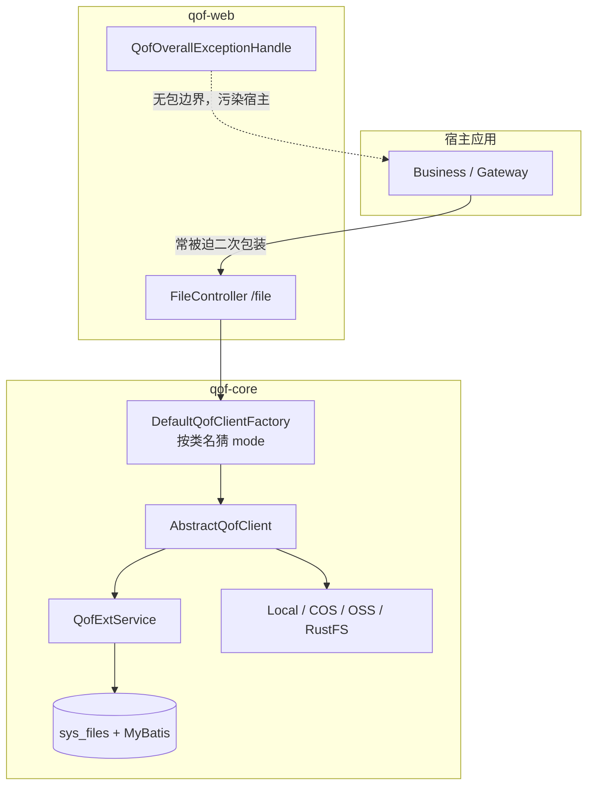
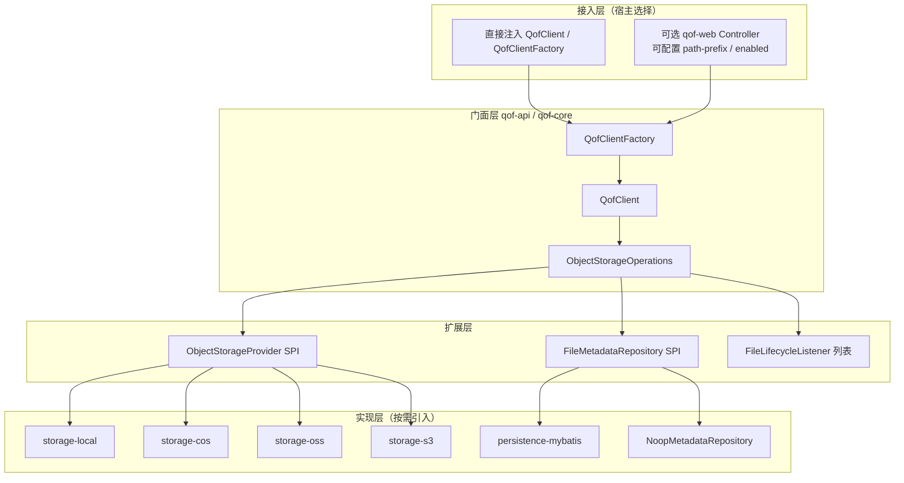

# QOF（快联文件桥）架构优化方案

| 项 | 内容 |
|---|---|
| 文档版本 | 1.1 |
| 适用代码版本 | 17.1.0（由 17.0.4 架构演进） |
| 目标读者 | 组件维护者、接入方架构师、评审人 |
| 撰写视角 | Apache 开源组件规范 + 互联网大厂 Java / Spring Boot Starter 工程实践 |
| 落地状态 | **阶段 A / B / C 主体已落地（17.2.0）**；Listener 强类型化、BOM 独立 artifact 等可继续演进 |

### 17.1.0 已落地摘要

- 父工程 `qof-parent`；新增 `qof-api` / `qof-spring-boot-autoconfigure` / 真正的 `qof-spring-boot-starter`；演示改为 `qof-examples`
- `ObjectStorageProvider` SPI + 工厂显式按 `mode()` 注册
- 去掉宽扫描与无边界 Advice；`qof.web.enabled` / `base-path` / `expose-advice`（默认关闭）
- RustFS 补齐 AutoConfiguration.imports；迁移说明见 `docs/migration/升级指南-17.1.0.md`

---

## 1. 背景与目标

### 1.1 背景

QOF 当前以「文件存储统一门面」为目标，已具备：

- SDK 门面：`QofClient` / `QofClientFactory`
- 多存储实现：local / COS / OSS / RustFS（S3 兼容）
- 可选 HTTP：`qof-web` 的 `FileController`
- 生命周期钩子：`QofExtService`

但在作为**第三方可复用组件**交付时，仍偏「业务工程切片」，而非标准 Spring Boot Starter：名不副实、依赖过重、自动配置过宽、扩展约定脆弱、文档与发布线脱节。mall 等宿主侧已出现「必须二次包装 Controller + 网关拉黑 `/file`」的典型症状。

### 1.2 优化目标

| 维度 | 目标 |
|---|---|
| 易用性 | 一行依赖 + 最少配置即可跑通「上传/下载/删除」 |
| 可裁剪 | 只用 local 不背云 SDK；不用 DB 可不引入持久化 |
| 不侵入 | 不污染宿主 Bean、异常、路由、Mapper 扫描 |
| 可扩展 | 官方 SPI，而非类名猜测 / `@Primary` 整类覆盖 |
| 契约稳定 | 明确 Public API、错误码、配置元数据、兼容策略 |
| 文档可信 | README / 配置表 / 版本号与代码一致 |

### 1.3 非目标（本期不做）

- 不重写全部存储协议细节
- 不绑定特定业务鉴权框架（Sa-Token / Spring Security 由宿主决定）
- 不强制统一宿主 `Result` 模型（组件侧提供可选适配，默认不注入全局 Advice）

---

## 2. 现状架构评估

### 2.1 模块现状

```text
qof-spring-boot-starter (pom, 17.0.4)
├── qof-core      # 核心 + 持久化 + 全量存储实现（过重）
├── qof-web       # FileController + 全局异常 + 宽扫描
└── qof-starter   # 可运行 Demo（被误写成「引入依赖」）
```

| 模块 | 职责（名义） | 职责（实际） | 评价 |
|---|---|---|---|
| `qof-core` | SDK | SDK + MyBatis/MySQL/Druid + COS/OSS/AWS SDK + `Result` | **上帝模块** |
| `qof-web` | HTTP API | 固定 `/file/**` + 无 basePackages 的 `@RestControllerAdvice` | **强侵入** |
| `qof-starter` | Starter | 带 `main` 的演示工程 | **命名误导** |

### 2.2 关键问题（按严重度）

#### P0 — 第三方接入体验差

1. **无真正 Starter**  
   父工程叫 `qof-spring-boot-starter`，但没有「只做依赖聚合 + AutoConfiguration、无业务代码」的 artifact；`qof-starter` 是 Demo，不宜被业务当库依赖。

2. **宽 `ComponentScan` + `@MapperScan`**  
   `QofConfiguration` / `QofCoreConfiguration` 扫描整个 `io.github.codeyunze`，引入即把 Controller、Advice、Service、Mapper 全部灌进宿主上下文。

3. **全局异常处理器无边界**  
   `QofOverallExceptionHandle` 无 `basePackages` / `assignableTypes`，会拦截宿主大量异常，并可能把 `RuntimeException.getMessage()` 回传前端。

4. **HTTP 路径硬编码 `/file`**  
   与网关、鉴权、业务路由冲突；生产侧通常必须二次 Controller，并屏蔽原生路径。

5. **core 依赖不可选**  
   仅用 local 也强制引入 MySQL、Druid、MyBatis-Plus、腾讯云 COS、阿里云 OSS、AWS S3 SDK。

#### P1 — 扩展与契约不规范

6. **工厂按类名猜测存储模式**  
   `DefaultQofClientFactory` 用 `XxxQofClient` 简单类名前缀匹配 mode，代理类、改名、同前缀多实现均会失效。

7. **扩展靠 `@Primary` 整类覆盖**  
   覆盖 `QofExtService` 后默认持久化逻辑易被「整锅端掉」，缺少可组合 Listener / Event。

8. **持久化开关语义不清**  
   `persistent-enable=false` 时上传可不入库，但下载仍依赖 `getFileInfoByFileId`，导致「关掉持久化后下载不可用」。

9. **响应模型放在 core**  
   `Result` / `ResultTable`、实体带 Jackson 注解，与宿主自有统一响应冲突（如 mall 的 `com.yz.mall.base.Result`）。

#### P2 — 文档、版本、完整性

10. README 版本仍写 `0.0.X`，实际发布 `17.0.4`；RustFS 已实现但文档/AutoConfiguration.imports 不完整；枚举含 MINIO 无实现；扩展示例引用不存在的 `SysFilesService`。

### 2.3 现状调用链（简图）



---

## 3. 设计原则

对齐 Apache 组件与大厂 Starter 惯例，确立以下原则：

| # | 原则 | 含义 |
|---|---|---|
| 1 | **最小依赖** | 默认只拉 API + 轻量实现；云 SDK / 持久化 / Web 均为可选 |
| 2 | **显式启用** | 功能靠 `qof.*.enabled` / 引入对应 starter，禁止「扫全包」 |
| 3 | **稳定契约** | Public API 与配置属性变更遵循兼容策略；内部类可演进 |
| 4 | **组合优于继承** | 扩展用 Listener / SPI 注册，避免 `@Primary` 整类替换 |
| 5 | **关注点分离** | 存储协议 ≠ 元数据持久化 ≠ HTTP 适配 ≠ 演示工程 |
| 6 | **宿主优先** | 默认不注册全局 Advice、不抢路由、不强制响应模型 |
| 7 | **可观测可诊断** | 启动时打印已启用 mode/station；错误信息可行动、无敏感泄漏 |

参考对象（对标，非抄袭）：

- Spring Boot 官方 Starter 拆分与 `AutoConfiguration.imports`
- Apache Commons 的「API 模块 + 实现模块」边界
- AWS SDK / Spring Cloud AWS 的「按服务拆依赖」
- 大厂内部 Object Storage Client：SPI 注册 + 可选元数据表

---

## 4. 目标架构

### 4.1 模块拆分（目标）

```text
qof (parent pom)
├── qof-bom                          # 版本 BOM，供第三方 import
├── qof-api                          # 纯接口 + DTO/BO/异常/SPI（零重依赖）
├── qof-core                         # 模板方法、工厂、校验、通用工具（不含云 SDK、不含 DB）
├── qof-storage-local                # local 实现
├── qof-storage-cos                  # 腾讯云 COS（依赖 optional/独立模块）
├── qof-storage-oss                  # 阿里云 OSS
├── qof-storage-s3                   # S3 兼容（RustFS / MinIO / 其他）
├── qof-persistence-mybatis           # 可选元数据持久化（MyBatis-Plus）
├── qof-spring-boot-autoconfigure    # 全部 AutoConfiguration（无业务 Controller）
├── qof-spring-boot-starter          # 默认 starter：api + core + autoconfigure + local
├── qof-spring-boot-starter-web      # 可选 HTTP（默认可关闭 Controller）
├── qof-spring-boot-starter-cos      # 按存储裁剪的 starter（oss/s3 同理）
└── qof-samples / qof-examples       # 演示工程（禁止被业务依赖）
```

> **命名纠偏：** 现 `qof-starter` 更名为 `qof-examples`（或 `qof-samples`），避免被当成 Starter 引入。

### 4.2 逻辑分层



### 4.3 依赖方向（硬约束）

```text
examples → starter-* → autoconfigure → core → api
storage-* → api（可依赖 core 工具，禁止依赖 web / persistence）
persistence-* → api
web → api + core（禁止反向）
任何实现模块禁止依赖 examples
```

---

## 5. 公共 API 与 SPI 设计

### 5.1 稳定 Public API（建议冻结语义）

| 类型 | 职责 |
|---|---|
| `QofClient` | 面向业务的文件操作门面（upload / download / preview / delete） |
| `QofClientFactory` | 按 **显式 mode**（或默认 mode）获取 Client |
| `QofFileInfo` / `QofObjectKey` 等 | 中立 DTO（去掉业务味命名，如逐步弱化 `SysFiles` 对外曝光） |
| 受检/运行时异常体系 | `QofException` 基类 + 明确错误码枚举 |

**工厂改造（替代类名猜测）：**

```java
public interface ObjectStorageProvider {
    /** 稳定 mode 标识，如 "local" / "cos" / "oss" / "s3" */
    String mode();
    QofClient create(QofClientContext context);
}

public interface QofClientFactory {
    QofClient getClient(String mode);
    QofClient getDefaultClient();
    Set<String> getAvailableModes();
}
```

注册方式（二选一或并存，推荐 Spring 注入优先）：

1. Spring：`List<ObjectStorageProvider>` + `@ConditionalOnProperty`
2. JDK SPI：`META-INF/services/io.github.codeyunze.spi.ObjectStorageProvider`（非 Spring 场景）

### 5.2 元数据仓储 SPI

将「是否落库」从存储实现中剥离：

```java
public interface FileMetadataRepository {
    Optional<FileMetadata> findById(Long fileId);
    Long insert(FileMetadata metadata);
    void update(FileMetadata metadata);
    boolean logicDelete(Long fileId);
}
```

- 默认：`NoopFileMetadataRepository`（纯对象存储，key 由调用方持有）
- 可选：`MybatisFileMetadataRepository`（现 `sys_files` 迁移至此模块）
- 宿主可自建：Redis / Mongo / 自有表

**语义澄清：**

| `qof.persistence.enabled` | 行为 |
|---|---|
| `false`（默认建议） | 上传返回存储侧 objectKey；download/delete 需调用方传 key 或自备元数据 |
| `true` | 上传写库返回 fileId；download/delete 可按 fileId |

禁止出现「关掉持久化却仍按 fileId 查库」的半残状态。

### 5.3 生命周期扩展（组合式）

废弃「必须 `@Primary` 继承 `AbstractQofServiceImpl`」作为唯一扩展方式，改为：

```java
public interface FileLifecycleListener {
    default void beforeUpload(UploadContext ctx) {}
    default void afterUpload(UploadContext ctx) {}
    default void beforeDownload(DownloadContext ctx) {}
    default void afterDownload(DownloadContext ctx) {}
    default void beforeDelete(DeleteContext ctx) {}
    default void afterDelete(DeleteContext ctx) {}
}
```

- 支持 **多个** Listener，按 `@Order` 执行
- 默认持久化作为内置 Listener（仅 `persistence.enabled=true` 时注册）
- 鉴权、审计、病毒扫描由宿主加 Listener，无需覆盖整类

保留 `QofExtService` 一到两个大版本作 `@Deprecated` 适配桥，避免立刻破坏存量接入。

---

## 6. 自动配置与配置体验

### 6.1 AutoConfiguration 规范

1. **删除** 宽 `@ComponentScan({"io.github.codeyunze"})`
2. 所有装配进入 `qof-spring-boot-autoconfigure`，经  
   `META-INF/spring/org.springframework.boot.autoconfigure.AutoConfiguration.imports` 注册
3. 条件装配示例：
   - `@ConditionalOnClass` + `@ConditionalOnProperty(prefix="qof.cos", name="enabled")`
   - Web：`@ConditionalOnProperty(prefix="qof.web", name="enabled", havingValue="true", matchIfMissing=false)`
   - Advice：默认关闭，或仅 `basePackages = "io.github.codeyunze.web"`
4. Controller 路径可配：`qof.web.base-path=/sys/file`（默认建议不启用内置 Controller）

### 6.2 推荐配置模型

```yaml
qof:
  default-mode: local
  web:
    enabled: false              # 默认关闭，避免抢路由
    base-path: /qof/files
    expose-advice: false        # 默认不注册全局异常
  persistence:
    enabled: true               # 需要 fileId 语义时再开
  validation:
    max-file-size: 100MB
    enable-magic-number: true
    preview-supported-types: [png, jpeg, pdf]
  local:
    enabled: true
    default-station: primary
    stations:
      primary:
        filepath: /data/files
  cos:
    enabled: false
    # ...
```

配套交付：

- `additional-spring-configuration-metadata.json`（IDE 提示）
- 配置校验：`@PostConstruct` / `Validator` 给出「缺哪项、怎么改」
- 启动日志一行摘要：`QOF started: modes=[local], persistence=true, web=false`

### 6.3 第三方最小接入（目标体验）

**仅 SDK + 本地盘：**

```xml
<dependency>
  <groupId>io.github.codeyunze</groupId>
  <artifactId>qof-spring-boot-starter</artifactId>
  <version>${qof.version}</version>
</dependency>
```

```yaml
qof:
  local:
    enabled: true
    stations:
      primary:
        filepath: /data/files
```

```java
@Resource
private QofClientFactory qofClientFactory;

Long id = qofClientFactory.getDefaultClient().upload(in, info);
```

**加 COS：** 再加 `qof-spring-boot-starter-cos`，打开 `qof.cos.enabled=true`。  
**加 HTTP：** 再加 `qof-spring-boot-starter-web`，显式 `qof.web.enabled=true`，自行叠加鉴权过滤器。

---

## 7. Web 层改造要点

| 现状 | 目标 |
|---|---|
| 固定 `/file/**` | `qof.web.base-path` 可配；默认可关闭 |
| 无鉴权 | 不内置鉴权；提供 `FileAccessDecision` SPI 或文档说明「由宿主 Filter/Interceptor 负责」 |
| 全局 Advice | 默认关闭；开启时仅处理 QOF 包内异常 |
| 自带 `Result` | 提供 `QofResponseBodyAdvice` 可选适配，或只抛异常由宿主处理 |
| mall 二次包装 | 目标：宿主可直接使用或极薄委托，无需复制粘贴 |

---

## 8. 版本、兼容与发布

### 8.1 版本策略建议

当前用「JDK 大版本对齐」的 `17.0.x` 可以保留，但需补充：

| 规则 | 说明 |
|---|---|
| MAJOR（17 → 21） | JDK 基线升级或破坏性架构迁移 |
| MINOR（17.0 → 17.1） | 新存储、新 SPI、新 starter（兼容） |
| PATCH（17.0.4 → 17.0.5） | Bugfix、文档、元数据 |

并行维护：

- `CHANGELOG.md`（Keep a Changelog）
- `docs/migration/升级指南-x.y.md`
- 废弃 API 至少保留 **一个 MINOR**，标注 `@Deprecated(forRemoval=false)` 与替代方案

### 8.2 破坏性变更分批（建议）

| 阶段 | 内容 | 兼容手段 |
|---|---|---|
| 17.1 | 新增 api/spi/autoconfigure/真正 starter；旧模块仍可用 | 旧 `qof-core` 暂保留，内部委托新实现 |
| 17.2 | Web 默认关闭 Controller；Advice 加边界 | 配置开关 `qof.web.enabled` |
| 17.3 | 云 SDK 拆到独立 starter；core 变轻 | 依赖迁移说明 |
| 18.0 或 17.10 | 删除类名猜测工厂、删除宽扫描、Demo 改名 | 大版本 / 明确 breaking |

---

## 9. 实施路线图

### 阶段 A — 止血（1～2 周，低风险）

- [ ] 修正 README 版本号、钩子签名、RustFS/OSS 示例；删除错误的 `SysFilesService` 引用
- [ ] `RustfsQofConfiguration` 补进 `AutoConfiguration.imports`
- [ ] `QofOverallExceptionHandle` 增加包边界；增加 `qof.web.expose-advice`（默认 false 需评估存量）
- [ ] `FileController` 增加 `qof.web.enabled` / `base-path`（默认保持旧行为或文档明确 breaking）
- [ ] 补充 `configuration-metadata.json`
- [ ] 明确：`qof-starter` 仅示例，README 禁止「业务引入」

### 阶段 B — 结构化（2～4 周）

- [ ] 抽出 `qof-api`、`qof-spring-boot-autoconfigure`、真正的 `qof-spring-boot-starter`
- [ ] 引入 `ObjectStorageProvider` 注册，工厂停止依赖类名
- [ ] `FileLifecycleListener` 多监听器；`QofExtService` 标记废弃并桥接
- [ ] `FileMetadataRepository` SPI + Noop / MyBatis 实现拆分
- [ ] 单元测试：工厂注册、条件装配、持久化开关矩阵

### 阶段 C — 依赖瘦身（2～3 周）

- [ ] `qof-storage-cos|oss|s3` 独立模块与 starter
- [ ] core 移除强制 MySQL/Druid/云 SDK
- [ ] BOM 发布，示例工程迁到 `qof-examples`
- [ ] 集成测试矩阵：local-only / cos / persistence on|off / web on|off

### 阶段 D — 生态与治理（持续）

- [ ] 错误码表、配置全量表、架构决策记录（ADR）
- [ ] 兼容性测试（Spring Boot 3.4 / 3.5）
- [ ] 安全基线：样例配置去真实感密钥；下载异常不回传内部细节

---

## 10. 验收标准（Definition of Done）

第三方接入方应能满足：

1. **5 分钟跑通**：只加一个 starter + 少于 10 行 YAML，完成本地上传下载  
2. **依赖可解释**：`mvn dependency:tree` 在 local-only 场景下**不出现** COS/OSS/AWS SDK  
3. **零路由冲突**：默认不暴露 `/file/**`，不注册无边界 Advice  
4. **可扩展**：自定义存储只需实现 `ObjectStorageProvider` 并注册 Bean，无需改名讨好工厂  
5. **可关闭持久化**：`persistence.enabled=false` 时仍有清晰的 objectKey 工作流  
6. **文档一致**：版本、模块职责、配置项、示例与代码同源  

---

## 11. 风险与对策

| 风险 | 对策 |
|---|---|
| 存量 mall / 业务已依赖 `qof-web` 路径与 Advice | 阶段 A 用开关默认兼容；迁移指南提供对照表 |
| 拆模块后 Central 坐标变化 | 保留过渡 artifact（旧坐标依赖新坐标），至少一个 MINOR |
| 持久化语义变更导致下载失败 | 特性开关 + 集成测试矩阵；发布说明置顶 |
| 包扫描删除导致「以前能扫到的自定义 Bean」失效 | 文档说明改用显式 `@Bean` / SPI |

---

## 12. 结论

QOF 的能力内核（统一上传下载、多站 station、钩子）是有价值的；当前主要短板不在「会不会传文件」，而在**组件化交付形态**：

> 从「可运行的业务片段」升级为「可裁剪、不侵入、契约清晰的 Spring Boot Starter 族」。

建议按 **止血 → 结构化 → 瘦身 → 治理** 四阶段推进：先消灭宽扫描与全局 Advice 等 P0 侵入，再引入 SPI 与真正 starter，最后拆分存储/持久化依赖。完成后再看第三方接入，应接近大厂内部中间件 Client 的体验，而不是「拷一份 Controller 并在网关拉黑原生接口」。

---

## 附录 A — 现状关键类索引

| 类 | 路径 | 备注 |
|---|---|---|
| `QofConfiguration` | `io.github.codeyunze` | 宽扫描 + MapperScan |
| `QofClient` / `DefaultQofClientFactory` | `io.github.codeyunze.core` | 工厂按类名匹配 |
| `QofExtService` | `io.github.codeyunze.service` | 单一扩展入口 |
| `FileController` | `io.github.codeyunze.controller` | 固定 `/file` |
| `QofOverallExceptionHandle` | `io.github.codeyunze.exception` | 无包边界 |
| `QofApplication` | `io.github.codeyunze`（starter 模块） | Demo 启动类 |

## 附录 B — 建议 ADR 清单（后续补充）

1. ADR-001：为何拆分 storage / persistence / web  
2. ADR-002：为何用 Provider SPI 替代类名工厂  
3. ADR-003：Web Controller 默认关闭的理由  
4. ADR-004：版本号与 JDK 对齐策略  
5. ADR-005：元数据 fileId vs objectKey 双语义  

## 附录 C — 参考

- Spring Boot Reference：Developing Auto-configuration  
- Spring Modulith / 多模块边界实践  
- Apache Project Maturity Model（社区与发布成熟度）  
- Keep a Changelog / SemVer（在 JDK 对齐版本上的兼容沟通方式）
